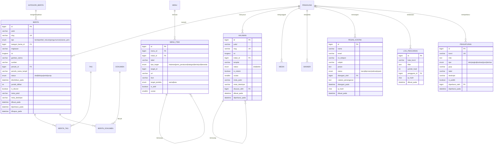
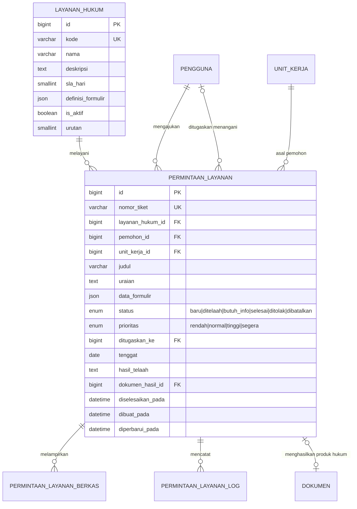

> **LEGACY DESIGN — BUKAN SUMBER KEBENARAN JDIH ITH V2.**
> Isi historis di bawah dipertahankan sebagai referensi, bukan target implementasi baru.
> Sumber kebenaran terbaru: [docs/CODEX_CONTEXT_JDIH_ITH_V2.md](CODEX_CONTEXT_JDIH_ITH_V2.md).
> Stack aktif adalah **NestJS + Next.js + TypeScript**. Rekomendasi Laravel/Blade/Livewire/Filament
> dalam dokumen lama telah digantikan dan hanya merupakan catatan historis.

# C. ENTITY RELATIONSHIP DIAGRAM (ERD)

Portal JDIH ITH Parepare

---

## C.1 Daftar Entitas

Sistem terdiri atas **50 entitas** yang dikelompokkan ke dalam 7 subsistem. Kolom **Jenis** menandai
peran entitas: `M` master/referensi, `T` transaksional, `P` penghubung (_junction_), `L` log/audit,
`K` konfigurasi.

### Subsistem 1 — Master Data dan Referensi (7 entitas)

| No  | Entitas           | Jenis | Deskripsi                                                                                                |
| --- | ----------------- | :---: | -------------------------------------------------------------------------------------------------------- |
| 1   | `unit_kerja`      |   M   | Unit kerja ITH secara berjenjang: rektorat, biro, fakultas, jurusan, program studi, lembaga, UPT, satuan |
| 2   | `jenis_peraturan` |   M   | Jenis/bentuk produk hukum beserta bentuk singkat, tingkat hierarki norma, dan lingkup penomoran          |
| 3   | `status_dokumen`  |   M   | Status keberlakuan: Berlaku, Diubah, Dicabut, Dicabut Sebagian, Belum Berlaku, Tidak Berlaku             |
| 4   | `bidang_hukum`    |   M   | Klasifikasi bidang hukum sesuai standar JDIHN                                                            |
| 5   | `kategori`        |   M   | Taksonomi klasifikasi internal ITH, berjenjang (contoh Akademik → Kurikulum)                             |
| 6   | `tag`             |   M   | Kata kunci/subjek pengindeksan dokumen dan berita                                                        |
| 7   | `jenis_relasi`    |   M   | Jenis relasi antarperaturan beserta pemetaan kode kebalikannya                                           |

### Subsistem 2 — Dokumen Hukum (14 entitas)

| No  | Entitas                    | Jenis | Deskripsi                                                                  |
| --- | -------------------------- | :---: | -------------------------------------------------------------------------- |
| 8   | `dokumen`                  |   T   | **Entitas inti.** Satu produk hukum beserta seluruh metadata standar JDIHN |
| 9   | `dokumen_berkas`           |   T   | Berkas PDF dan lampiran milik satu dokumen                                 |
| 10  | `dokumen_kategori`         |   P   | Penghubung dokumen dengan kategori (M:N)                                   |
| 11  | `dokumen_tag`              |   P   | Penghubung dokumen dengan kata kunci (M:N)                                 |
| 12  | `dokumen_relasi`           |   P   | Relasi antardokumen (M:N rekursif dengan atribut jenis relasi)             |
| 13  | `dokumen_akses`            |   P   | Daftar subjek berhak atas dokumen bertingkat akses "terbatas"              |
| 14  | `dokumen_alur`             |   L   | Riwayat transisi status publikasi dan status keberlakuan                   |
| 15  | `dokumen_riwayat`          |   L   | Cuplikan versi metadata untuk pembandingan perubahan                       |
| 16  | `dokumen_statistik_harian` |   T   | Agregat harian jumlah dilihat dan diunduh per dokumen                      |
| 17  | `unduhan`                  |   L   | Catatan setiap peristiwa unduhan berkas                                    |
| 18  | `permintaan_akses`         |   T   | Pengajuan akses dokumen terbatas beserta keputusannya                      |
| 19  | `koleksi_pengguna`         |   P   | Penanda dokumen pada koleksi pribadi pengguna                              |
| 20  | `impor_batch`              |   T   | Catatan proses impor massal metadata beserta laporannya                    |
| 21  | `log_sinkronisasi_jdihn`   |   L   | Riwayat pengiriman metadata ke JDIHN                                       |

### Subsistem 3 — Pengguna, Peran, dan Otorisasi (8 entitas)

| No  | Entitas               | Jenis | Deskripsi                                              |
| --- | --------------------- | :---: | ------------------------------------------------------ |
| 22  | `pengguna`            |   T   | Akun pengguna sistem                                   |
| 23  | `peran`               |   M   | Peran: Superadmin, Admin, Dosen/Staf, Pengunjung       |
| 24  | `izin`                |   M   | Butir izin berformat `modul.aksi`                      |
| 25  | `peran_izin`          |   P   | Penghubung peran dengan izin (M:N)                     |
| 26  | `pengguna_peran`      |   P   | Penghubung pengguna dengan peran (M:N)                 |
| 27  | `pengguna_izin`       |   P   | Pemberian atau pencabutan izin langsung pada satu akun |
| 28  | `pengguna_unit_akses` |   P   | Unit kerja tambahan yang dapat dikelola seorang Admin  |
| 29  | `token_reset_sandi`   |   T   | _Token_ sekali pakai untuk pemulihan kata sandi        |

### Subsistem 4 — Konten Informasi Hukum (10 entitas)

| No  | Entitas           | Jenis | Deskripsi                                           |
| --- | ----------------- | :---: | --------------------------------------------------- |
| 30  | `berita`          |   T   | Berita, artikel hukum, pengumuman, dan siaran pers  |
| 31  | `kategori_berita` |   M   | Kategori konten berita                              |
| 32  | `berita_tag`      |   P   | Penghubung berita dengan kata kunci (M:N)           |
| 33  | `berita_dokumen`  |   P   | Penghubung berita dengan dokumen yang dirujuk (M:N) |
| 34  | `halaman`         |   T   | Halaman statis berjenjang                           |
| 35  | `menu`            |   K   | Kelompok menu navigasi per lokasi tampil            |
| 36  | `menu_item`       |   K   | Butir menu berjenjang                               |
| 37  | `banner`          |   T   | Banner/sorotan beranda beserta jadwal tampil        |
| 38  | `media`           |   T   | Pustaka berkas media (gambar konten)                |
| 39  | `tautan_terkait`  |   M   | Tautan mitra dan jaringan                           |

### Subsistem 5 — Interaksi Publik (3 entitas)

| No  | Entitas         | Jenis | Deskripsi                                              |
| --- | --------------- | :---: | ------------------------------------------------------ |
| 40  | `faq`           |   M   | Daftar tanya-jawab                                     |
| 41  | `pesan_kontak`  |   T   | Pesan masuk dari formulir kontak beserta penanganannya |
| 42  | `log_pencarian` |   L   | Catatan kata kunci dan penyaring pencarian             |

### Subsistem 6 — Sistem, Audit, dan Notifikasi (4 entitas)

| No  | Entitas           | Jenis | Deskripsi                                        |
| --- | ----------------- | :---: | ------------------------------------------------ |
| 43  | `pengaturan`      |   K   | Konfigurasi sistem berbentuk kunci–nilai bertipe |
| 44  | `log_aktivitas`   |   L   | Jejak audit seluruh operasi tulis                |
| 45  | `log_autentikasi` |   L   | Peristiwa autentikasi dan keamanan akun          |
| 46  | `notifikasi`      |   T   | Notifikasi dalam aplikasi per pengguna           |

### Subsistem 7 — Layanan Hukum _(opsional, Fase 3)_ (4 entitas)

| No  | Entitas                     | Jenis | Deskripsi                                               |
| --- | --------------------------- | :---: | ------------------------------------------------------- |
| 47  | `layanan_hukum`             |   M   | Katalog jenis layanan beserta SLA dan definisi formulir |
| 48  | `permintaan_layanan`        |   T   | Tiket permohonan layanan hukum                          |
| 49  | `permintaan_layanan_berkas` |   T   | Lampiran berkas pada permohonan                         |
| 50  | `permintaan_layanan_log`    |   L   | Riwayat penanganan permohonan                           |

> **Rekapitulasi**: Subsistem 1 = 7, Subsistem 2 = 14, Subsistem 3 = 8, Subsistem 4 = 10,
> Subsistem 5 = 3, Subsistem 6 = 4, Subsistem 7 = 4 → **50 entitas**. Subsistem 7 bersifat opsional,
> sehingga **inti sistem (Fase 1–2) terdiri atas 46 entitas**; empat entitas Subsistem 7 ditambahkan
> pada Fase 3. Seluruh 50 tabel telah terbentuk dan diuji — lihat
> [04-struktur-basis-data.md § D.8](04-struktur-basis-data.md#d8-hasil-pengujian-skema).

---

## C.2 ERD Konseptual (Tingkat Tinggi)

Diagram berikut menyajikan relasi antarsubsistem tanpa detail atribut, untuk memahami peta besar
sistem sebelum masuk ke ERD logis.

```
        ┌──────────────────────────┐
        │   MASTER & REFERENSI     │
        │  unit_kerja              │
        │  jenis_peraturan         │
        │  status_dokumen          │──────┐
        │  bidang_hukum            │      │ mengklasifikasikan
        │  kategori · tag          │      │ (1:N dan M:N)
        │  jenis_relasi            │      │
        └──────────┬───────────────┘      │
                   │ menaungi             ▼
                   │              ┌───────────────────────────────────┐
                   │              │        DOKUMEN HUKUM              │
                   │              │  ┌─────────────────────────────┐  │
                   │              │  │         dokumen             │  │◀─┐
                   │              │  │  (entitas inti / pusat)     │  │  │ relasi
                   │              │  └──┬───────┬──────────┬───────┘  │  │ rekursif
                   │              │     │ 1:N   │ 1:N      │ 1:N      │  │ M:N
                   │              │     ▼       ▼          ▼          │  │
                   │              │  berkas  alur/riwayat statistik   │──┘
                   │              │  akses   unduhan     sinkronisasi │
                   │              └───────┬───────────────────────────┘
                   │                      │ mengelola, mengunduh,
                   │                      │ memverifikasi (1:N)
        ┌──────────▼───────────────┐      │
        │  PENGGUNA & OTORISASI    │◀─────┘
        │  pengguna ─M:N─ peran    │
        │  peran ─M:N─ izin        │──────┐ menulis, menanggapi (1:N)
        │  pengguna_unit_akses     │      │
        └──────────┬───────────────┘      ▼
                   │              ┌───────────────────────────────────┐
                   │ mencatat     │   KONTEN INFORMASI HUKUM          │
                   │ (1:N)        │  berita ─M:N─ tag, dokumen        │
                   ▼              │  halaman · menu · banner · media  │
        ┌──────────────────────────┐  tautan_terkait · faq            │
        │  SISTEM & AUDIT          └───────────────────────────────────┘
        │  log_aktivitas           │
        │  log_autentikasi         │      ┌───────────────────────────┐
        │  log_pencarian           │      │  INTERAKSI PUBLIK         │
        │  notifikasi · pengaturan │      │  pesan_kontak             │
        └──────────────────────────┘      └───────────────────────────┘

        ┌──────────────────────────────────────────────────────────────┐
        │  LAYANAN HUKUM (opsional, Fase 3)                            │
        │  layanan_hukum 1:N permintaan_layanan 1:N berkas, log        │
        │  permintaan_layanan N:1 pengguna, N:1 unit_kerja             │
        └──────────────────────────────────────────────────────────────┘
```

**Pola desain utama** — entitas `dokumen` berperan sebagai pusat (_hub_) yang dirujuk oleh hampir
seluruh subsistem lain. Konsekuensi desainnya: (a) tabel `dokumen` tidak boleh memuat kolom yang
bersifat multinilai atau jarang terisi secara ekstrem, karena akan memperbesar baris yang paling
sering dibaca; (b) seluruh data bervolume tinggi (unduhan, log, statistik) ditempatkan pada tabel
terpisah dengan relasi 1:N agar tabel inti tetap ringkas.

---

## C.3 ERD Logis — Subsistem Dokumen Hukum

```mermaid
erDiagram
    UNIT_KERJA ||--o{ UNIT_KERJA : "menaungi"
    UNIT_KERJA ||--o{ DOKUMEN : "mengelola"
    JENIS_PERATURAN ||--o{ DOKUMEN : "mengklasifikasikan"
    STATUS_DOKUMEN ||--o{ DOKUMEN : "menyatakan keberlakuan"
    BIDANG_HUKUM |o--o{ DOKUMEN : "membidangi"
    PENGGUNA ||--o{ DOKUMEN : "membuat"
    PENGGUNA |o--o{ DOKUMEN : "memverifikasi"
    PENGGUNA |o--o{ DOKUMEN : "menerbitkan"

    DOKUMEN ||--o{ DOKUMEN_BERKAS : "memiliki"
    DOKUMEN ||--o{ DOKUMEN_KATEGORI : ""
    KATEGORI ||--o{ DOKUMEN_KATEGORI : ""
    KATEGORI ||--o{ KATEGORI : "menaungi"
    DOKUMEN ||--o{ DOKUMEN_TAG : ""
    TAG ||--o{ DOKUMEN_TAG : ""

    DOKUMEN ||--o{ DOKUMEN_RELASI : "sebagai sumber"
    DOKUMEN ||--o{ DOKUMEN_RELASI : "sebagai sasaran"
    JENIS_RELASI ||--o{ DOKUMEN_RELASI : "menentukan jenis"

    DOKUMEN ||--o{ DOKUMEN_AKSES : "membatasi"
    DOKUMEN ||--o{ DOKUMEN_ALUR : "mencatat transisi"
    DOKUMEN ||--o{ DOKUMEN_RIWAYAT : "menyimpan versi"
    DOKUMEN ||--o{ DOKUMEN_STATISTIK_HARIAN : "meringkas"
    DOKUMEN ||--o{ UNDUHAN : "diunduh pada"
    DOKUMEN_BERKAS ||--o{ UNDUHAN : "berkas terunduh"
    DOKUMEN ||--o{ PERMINTAAN_AKSES : "dimohonkan"
    DOKUMEN ||--o{ LOG_SINKRONISASI_JDIHN : "disinkronkan"
    DOKUMEN ||--o{ KOLEKSI_PENGGUNA : ""
    PENGGUNA ||--o{ KOLEKSI_PENGGUNA : ""
    PENGGUNA ||--o{ UNDUHAN : "mengunduh"
    PENGGUNA ||--o{ PERMINTAAN_AKSES : "mengajukan"
    IMPOR_BATCH ||--o{ DOKUMEN : "menghasilkan"

    DOKUMEN {
        bigint id PK
        varchar kode_dokumen UK "JDIH-ITH-2026-000123"
        varchar slug UK
        bigint jenis_peraturan_id FK
        varchar nomor
        varchar nomor_normal "generated, untuk cek duplikasi"
        varchar nomor_lengkap
        smallint tahun
        varchar judul
        varchar teu "Tempat, Entitas, Uraian"
        date tanggal_penetapan
        date tanggal_pengundangan
        date tanggal_berlaku
        date tanggal_berakhir
        varchar tempat_penetapan
        varchar penerbit
        varchar penandatangan
        varchar jabatan_penandatangan
        varchar sumber
        bigint unit_kerja_id FK
        bigint bidang_hukum_id FK
        bigint status_dokumen_id FK
        enum lingkup "internal|eksternal"
        enum tingkat_akses "publik|internal|terbatas|rahasia"
        enum status_publikasi "draf|diajukan|revisi|disetujui|terbit|ditarik"
        char bahasa
        varchar deskripsi_fisik
        varchar nomor_panggil
        varchar lokasi_arsip
        text abstrak
        text catatan
        longtext isi_teks "hasil ekstraksi PDF/OCR"
        int jumlah_dilihat
        int jumlah_diunduh
        datetime diterbitkan_pada
        datetime dijadwalkan_terbit_pada
        boolean is_disorot
        enum sinkron_jdihn
        varchar jdihn_id
        datetime disinkron_pada
        int versi "optimistic locking"
        bigint dibuat_oleh FK
        bigint diperiksa_oleh FK
        bigint diterbitkan_oleh FK
        datetime dibuat_pada
        datetime diperbarui_pada
        datetime dihapus_pada "soft delete"
    }

    DOKUMEN_BERKAS {
        bigint id PK
        bigint dokumen_id FK
        enum jenis_berkas "dokumen_utama|lampiran|abstrak|naskah_akademik|terjemahan"
        varchar nama_asli
        varchar nama_simpan
        varchar path UK
        varchar disk
        varchar mime_type
        bigint ukuran_bytes
        smallint jumlah_halaman
        char hash_sha256
        smallint urutan
        boolean is_publik
        boolean is_pratinjau
        boolean is_versi_aktif
        int jumlah_diunduh
        enum status_ekstraksi "menunggu|berhasil|gagal|tidak_perlu"
        varchar keterangan
        bigint dibuat_oleh FK
        datetime dibuat_pada
        datetime diperbarui_pada
    }

    DOKUMEN_RELASI {
        bigint id PK
        bigint dokumen_id FK
        bigint dokumen_terkait_id FK
        bigint jenis_relasi_id FK
        varchar keterangan
        bigint dibuat_oleh FK
        datetime dibuat_pada
    }

    JENIS_RELASI {
        bigint id PK
        varchar kode UK "mengubah|mencabut|dasar_hukum|..."
        varchar nama
        varchar nama_kebalikan "diubah oleh|dicabut oleh"
        varchar kode_kebalikan
        boolean is_simetris
        boolean is_mengubah_status
        bigint status_akibat_id FK
        boolean is_sistem
        smallint urutan
    }

    DOKUMEN_AKSES {
        bigint id PK
        bigint dokumen_id FK
        enum subjek_tipe "peran|unit_kerja|pengguna"
        bigint subjek_id
        enum izin "lihat|unduh"
        bigint dibuat_oleh FK
        datetime dibuat_pada
    }

    DOKUMEN_ALUR {
        bigint id PK
        bigint dokumen_id FK
        enum konteks "publikasi|keberlakuan"
        varchar status_dari
        varchar status_ke
        varchar aksi
        text catatan
        bigint dokumen_dasar_id FK
        bigint oleh_id FK
        datetime dibuat_pada
    }

    DOKUMEN_RIWAYAT {
        bigint id PK
        bigint dokumen_id FK
        int versi
        json cuplikan_metadata
        json cuplikan_berkas
        varchar ringkasan_perubahan
        bigint oleh_id FK
        datetime dibuat_pada
    }

    UNDUHAN {
        bigint id PK
        bigint dokumen_id FK
        bigint dokumen_berkas_id FK
        bigint pengguna_id FK
        varchar peran_saat_unduh
        char ip_hash "SHA-256 bergaram"
        varchar agen_ringkas
        varchar perujuk
        datetime dibuat_pada
    }

    PERMINTAAN_AKSES {
        bigint id PK
        bigint dokumen_id FK
        bigint pengguna_id FK
        text alasan
        enum status "menunggu|disetujui|ditolak|kedaluwarsa"
        bigint diputuskan_oleh FK
        text catatan_keputusan
        datetime diputuskan_pada
        date berlaku_hingga
        datetime dibuat_pada
    }
```



---

## C.4 ERD Logis — Subsistem Pengguna dan Otorisasi

```mermaid
erDiagram
    UNIT_KERJA ||--o{ PENGGUNA : "menaungi"
    PENGGUNA ||--o{ PENGGUNA_PERAN : ""
    PERAN ||--o{ PENGGUNA_PERAN : ""
    PERAN ||--o{ PERAN_IZIN : ""
    IZIN ||--o{ PERAN_IZIN : ""
    PENGGUNA ||--o{ PENGGUNA_IZIN : "diberi/dicabut langsung"
    IZIN ||--o{ PENGGUNA_IZIN : ""
    PENGGUNA ||--o{ PENGGUNA_UNIT_AKSES : ""
    UNIT_KERJA ||--o{ PENGGUNA_UNIT_AKSES : ""
    PENGGUNA ||--o{ TOKEN_RESET_SANDI : "memohon"
    PENGGUNA ||--o{ LOG_AUTENTIKASI : "menghasilkan"
    PENGGUNA ||--o{ LOG_AKTIVITAS : "melakukan"
    PENGGUNA ||--o{ NOTIFIKASI : "menerima"
    PENGGUNA |o--o{ PENGGUNA : "memverifikasi akun"

    PENGGUNA {
        bigint id PK
        varchar nama_lengkap
        varchar email UK
        varchar nip_nidn UK
        varchar kata_sandi "hash Argon2id/bcrypt"
        varchar no_telepon
        bigint unit_kerja_id FK
        varchar jabatan
        varchar foto
        enum status "menunggu_verifikasi|aktif|nonaktif|ditangguhkan"
        datetime email_terverifikasi_pada
        boolean is_2fa_aktif
        varchar rahasia_2fa "terenkripsi"
        json kode_pemulihan_2fa
        smallint jumlah_gagal_login
        datetime dikunci_hingga
        datetime terakhir_login_pada
        varchar terakhir_login_ip
        varchar sumber_akun "lokal|sso"
        varchar sso_subject UK
        bigint diverifikasi_oleh FK
        datetime diverifikasi_pada
        varchar token_ingat
        datetime dibuat_pada
        datetime diperbarui_pada
        datetime dihapus_pada
    }

    PERAN {
        bigint id PK
        varchar kode UK "superadmin|admin|dosen_staf|pengunjung"
        varchar nama
        varchar deskripsi
        boolean is_sistem "tidak dapat dihapus"
        boolean is_anonim "peran untuk pengunjung tanpa login"
        boolean is_wajib_2fa
        smallint tingkat "urutan kewenangan"
        datetime dibuat_pada
        datetime diperbarui_pada
    }

    IZIN {
        bigint id PK
        varchar kode UK "dokumen.terbitkan"
        varchar nama
        varchar modul
        varchar deskripsi
        boolean is_berdampak_tinggi
        boolean is_sistem
        smallint urutan
    }

    PERAN_IZIN {
        bigint peran_id PK-FK
        bigint izin_id PK-FK
        bigint diberikan_oleh FK
        datetime dibuat_pada
    }

    PENGGUNA_PERAN {
        bigint pengguna_id PK-FK
        bigint peran_id PK-FK
        bigint ditetapkan_oleh FK
        datetime dibuat_pada
    }

    PENGGUNA_IZIN {
        bigint id PK
        bigint pengguna_id FK
        bigint izin_id FK
        enum mode "berikan|cabut"
        date berlaku_hingga
        varchar alasan
        bigint ditetapkan_oleh FK
        datetime dibuat_pada
    }

    PENGGUNA_UNIT_AKSES {
        bigint pengguna_id PK-FK
        bigint unit_kerja_id PK-FK
        boolean termasuk_bawahan
        bigint ditetapkan_oleh FK
        datetime dibuat_pada
    }

    UNIT_KERJA {
        bigint id PK
        varchar kode UK
        varchar nama
        varchar singkatan
        enum jenis "rektorat|biro|fakultas|jurusan|prodi|lembaga|upt|satuan|senat|eksternal"
        bigint induk_id FK
        varchar jalur "materialized path, mis. 1/4/12"
        smallint kedalaman
        varchar kepala_unit
        varchar email_unit
        boolean is_aktif
        smallint urutan
        datetime dibuat_pada
        datetime diperbarui_pada
    }

    LOG_AKTIVITAS {
        bigint id PK
        bigint pengguna_id FK
        varchar peran_saat_itu
        varchar aksi
        varchar entitas
        bigint entitas_id
        varchar deskripsi
        json data_lama
        json data_baru
        char ip_hash
        varchar agen_ringkas
        datetime dibuat_pada
    }

    LOG_AUTENTIKASI {
        bigint id PK
        bigint pengguna_id FK
        varchar email_dicoba
        enum aksi "login_berhasil|login_gagal|logout|terkunci|reset_diminta|reset_berhasil|2fa_gagal"
        varchar keterangan
        char ip_hash
        varchar agen_ringkas
        datetime dibuat_pada
    }
```

---

## C.5 ERD Logis — Subsistem Konten dan Sistem



---

## C.6 ERD Logis — Subsistem Layanan Hukum _(opsional, Fase 3)_



---

## C.7 Penjelasan Seluruh Relasi

Notasi kardinalitas: `1:N` satu ke banyak · `M:N` banyak ke banyak · `1:1` satu ke satu ·
`1:N rekursif` relasi ke tabel sendiri. Kolom **On Delete** menyatakan aksi referensial yang
diterapkan pada _foreign key_.

### C.7.1 Relasi Subsistem Master Data

| No   | Relasi                            | Kardinalitas | Partisipasi | On Delete  | Penjelasan dan Justifikasi                                                                                                                                                                                                                                                                                                                                                                       |
| ---- | --------------------------------- | ------------ | ----------- | ---------- | ------------------------------------------------------------------------------------------------------------------------------------------------------------------------------------------------------------------------------------------------------------------------------------------------------------------------------------------------------------------------------------------------ |
| R-01 | `unit_kerja` → `unit_kerja`       | 1:N rekursif | opsional    | `RESTRICT` | Satu unit kerja dapat menaungi banyak unit bawahan; satu unit memiliki paling banyak satu induk. Unit tertinggi (Institut) memiliki `induk_id = NULL`. Kolom `jalur` (_materialized path_) ditambahkan agar kueri "seluruh unit bawahan" dapat dilakukan dengan satu operasi `LIKE 'jalur%'`, tanpa rekursi berulang. `RESTRICT` mencegah unit induk terhapus selama masih memiliki unit bawahan |
| R-02 | `kategori` → `kategori`           | 1:N rekursif | opsional    | `RESTRICT` | Taksonomi berjenjang (contoh: _Akademik → Kurikulum → Kurikulum Sarjana_). Sama seperti R-01, memakai `jalur` untuk pencarian berjenjang                                                                                                                                                                                                                                                         |
| R-03 | `jenis_relasi` → `status_dokumen` | 1:N          | opsional    | `SET NULL` | Jenis relasi yang bersifat mengubah keberlakuan (contoh "mencabut") menunjuk status akibat yang harus dikenakan pada dokumen sasaran (contoh "Dicabut"). Relasi ini memindahkan aturan bisnis dari kode program ke data, sehingga penambahan jenis relasi baru tidak memerlukan perubahan kode                                                                                                   |

### C.7.2 Relasi Subsistem Dokumen Hukum

| No   | Relasi                                             | Kardinalitas                | Partisipasi                         | On Delete                                                         | Penjelasan dan Justifikasi                                                                                                                                                                                                                                                                                                                                                                                                                                                                                                                                                                                                                                                                                           |
| ---- | -------------------------------------------------- | --------------------------- | ----------------------------------- | ----------------------------------------------------------------- | -------------------------------------------------------------------------------------------------------------------------------------------------------------------------------------------------------------------------------------------------------------------------------------------------------------------------------------------------------------------------------------------------------------------------------------------------------------------------------------------------------------------------------------------------------------------------------------------------------------------------------------------------------------------------------------------------------------------- |
| R-04 | `jenis_peraturan` → `dokumen`                      | 1:N                         | wajib pada `dokumen`                | `RESTRICT`                                                        | Setiap dokumen wajib memiliki tepat satu jenis peraturan. `RESTRICT` menegakkan BR-24: jenis peraturan yang masih dirujuk tidak dapat dihapus, hanya dinonaktifkan                                                                                                                                                                                                                                                                                                                                                                                                                                                                                                                                                   |
| R-05 | `unit_kerja` → `dokumen`                           | 1:N                         | wajib pada `dokumen`                | `RESTRICT`                                                        | Setiap dokumen memiliki tepat satu unit kerja pengelola/penanggung jawab. Untuk dokumen eksternal (peraturan tingkat nasional yang dikatalog sebagai rujukan), unit kerja menunjuk unit ITH yang mengkurasinya, sementara instansi penerbit aslinya dicatat pada kolom `penerbit` dan `teu`. Relasi ini menjadi dasar pembatasan cakupan data Admin (BR-15)                                                                                                                                                                                                                                                                                                                                                          |
| R-06 | `status_dokumen` → `dokumen`                       | 1:N                         | wajib pada `dokumen`                | `RESTRICT`                                                        | Status keberlakuan dinormalisasi ke tabel referensi, bukan disimpan sebagai `ENUM`, agar kode warna penanda dan urutan tampil dapat dikelola tanpa migrasi skema                                                                                                                                                                                                                                                                                                                                                                                                                                                                                                                                                     |
| R-07 | `bidang_hukum` → `dokumen`                         | 1:N                         | opsional                            | `SET NULL`                                                        | Bidang hukum merupakan klasifikasi standar JDIHN dan bersifat opsional pada tahap awal katalogisasi. `SET NULL` dipilih agar penghapusan klasifikasi tidak menghapus dokumen                                                                                                                                                                                                                                                                                                                                                                                                                                                                                                                                         |
| R-08 | `dokumen` → `dokumen_berkas`                       | 1:N                         | wajib satu berkas utama saat terbit | `CASCADE`                                                         | Satu dokumen memiliki nol atau lebih berkas saat berstatus draf, dan wajib memiliki minimal satu berkas berjenis `dokumen_utama` saat diterbitkan (BR-04). `CASCADE` diterapkan karena berkas tidak bermakna tanpa dokumen induknya; penghapusan berkas fisik pada penyimpanan dilakukan oleh _observer_ aplikasi, bukan oleh basis data                                                                                                                                                                                                                                                                                                                                                                             |
| R-09 | `dokumen` ↔ `kategori` melalui `dokumen_kategori`  | M:N                         | minimal satu kategori saat terbit   | `CASCADE` keduanya                                                | Satu dokumen dapat masuk beberapa kategori (contoh peraturan tentang beasiswa masuk kategori _Kemahasiswaan_ dan _Keuangan_), dan satu kategori memuat banyak dokumen. Tanpa tabel penghubung, kategori harus disimpan sebagai daftar dalam satu kolom — melanggar 1NF                                                                                                                                                                                                                                                                                                                                                                                                                                               |
| R-10 | `dokumen` ↔ `tag` melalui `dokumen_tag`            | M:N                         | opsional                            | `CASCADE` keduanya                                                | Kata kunci/subjek pengindeksan bersifat bebas dan berjumlah banyak per dokumen. Tabel penghubung memungkinkan penelusuran dua arah: dokumen per kata kunci dan kata kunci per dokumen                                                                                                                                                                                                                                                                                                                                                                                                                                                                                                                                |
| R-11 | `dokumen` ↔ `dokumen` melalui `dokumen_relasi`     | M:N rekursif dengan atribut | opsional                            | `CASCADE` pada `dokumen_id`, `RESTRICT` pada `dokumen_terkait_id` | **Relasi paling kompleks pada sistem.** Satu dokumen dapat berelasi dengan banyak dokumen lain, dengan jenis relasi berbeda (mengubah, mencabut, dasar hukum, dilaksanakan oleh, terkait). Karena relasi memiliki atributnya sendiri (jenis relasi, keterangan, pembuat), relasi ini diwujudkan sebagai entitas asosiatif, bukan sebagai kolom pada `dokumen`. **Arah penyimpanan**: hanya arah aktif yang disimpan (contoh A "mencabut" B); arah pasif ("B dicabut oleh A") diturunkan melalui `jenis_relasi.kode_kebalikan` (BR-19), sehingga tidak terjadi redundansi dan tidak ada risiko data tidak sinkron. `RESTRICT` pada `dokumen_terkait_id` mencegah dokumen yang menjadi rujukan terhapus tanpa disadari |
| R-12 | `jenis_relasi` → `dokumen_relasi`                  | 1:N                         | wajib                               | `RESTRICT`                                                        | Setiap relasi wajib memiliki tepat satu jenis                                                                                                                                                                                                                                                                                                                                                                                                                                                                                                                                                                                                                                                                        |
| R-13 | `dokumen` → `dokumen_akses`                        | 1:N                         | opsional                            | `CASCADE`                                                         | Daftar subjek berhak atas dokumen bertingkat akses "terbatas". Kolom `subjek_tipe` + `subjek_id` membentuk relasi polimorfik ke `peran`, `unit_kerja`, atau `pengguna`. **Catatan desain**: pola polimorfik mengorbankan penegakan _foreign key_ di tingkat basis data, dan ditebus dengan validasi di lapisan aplikasi serta tugas pemeriksaan integritas berkala. Alternatifnya (tiga tabel terpisah) menghasilkan duplikasi struktur dan kueri yang lebih rumit; pilihan ini dijelaskan pada Bagian H § H.5                                                                                                                                                                                                       |
| R-14 | `dokumen` → `dokumen_alur`                         | 1:N                         | opsional                            | `CASCADE`                                                         | Riwayat seluruh transisi status, baik status publikasi maupun status keberlakuan, dibedakan oleh kolom `konteks`. Penggabungan dua jenis riwayat pada satu tabel dipilih karena strukturnya identik (status asal, status tujuan, pelaku, waktu, catatan)                                                                                                                                                                                                                                                                                                                                                                                                                                                             |
| R-15 | `dokumen` → `dokumen_alur` (sebagai dokumen dasar) | 1:N                         | opsional                            | `SET NULL`                                                        | Suatu transisi status keberlakuan dapat memiliki dokumen dasar (contoh: status menjadi "Dicabut" karena Peraturan Rektor Nomor X)                                                                                                                                                                                                                                                                                                                                                                                                                                                                                                                                                                                    |
| R-16 | `dokumen` → `dokumen_riwayat`                      | 1:N                         | opsional                            | `CASCADE`                                                         | Cuplikan metadata per versi disimpan sebagai JSON. Pilihan JSON (bukan tabel kolom-per-kolom) diambil karena tujuannya adalah pengarsipan dan pembandingan, bukan pencarian per kolom historis                                                                                                                                                                                                                                                                                                                                                                                                                                                                                                                       |
| R-17 | `dokumen` → `dokumen_statistik_harian`             | 1:N                         | opsional                            | `CASCADE`                                                         | Agregat harian dengan kunci utama gabungan (`dokumen_id`, `tanggal`). Tabel ini mencegah halaman statistik melakukan agregasi atas tabel `unduhan` yang bervolume besar                                                                                                                                                                                                                                                                                                                                                                                                                                                                                                                                              |
| R-18 | `dokumen` → `unduhan`                              | 1:N                         | opsional                            | `CASCADE`                                                         | Satu dokumen menghasilkan banyak peristiwa unduhan                                                                                                                                                                                                                                                                                                                                                                                                                                                                                                                                                                                                                                                                   |
| R-19 | `dokumen_berkas` → `unduhan`                       | 1:N                         | opsional                            | `SET NULL`                                                        | Unduhan mencatat berkas spesifik yang diambil. `SET NULL` dipilih agar riwayat unduhan tetap utuh sebagai data statistik meskipun berkas telah diganti                                                                                                                                                                                                                                                                                                                                                                                                                                                                                                                                                               |
| R-20 | `pengguna` → `unduhan`                             | 1:N                         | opsional                            | `SET NULL`                                                        | `pengguna_id` bernilai `NULL` untuk unduhan oleh pengunjung anonim. Kolom `peran_saat_unduh` menyimpan peran pada saat peristiwa terjadi (_snapshot_), sehingga statistik historis tetap akurat meskipun peran pengguna berubah kemudian                                                                                                                                                                                                                                                                                                                                                                                                                                                                             |
| R-21 | `dokumen` → `permintaan_akses`                     | 1:N                         | opsional                            | `CASCADE`                                                         | Satu dokumen terbatas dapat dimohonkan oleh banyak pengguna                                                                                                                                                                                                                                                                                                                                                                                                                                                                                                                                                                                                                                                          |
| R-22 | `pengguna` → `permintaan_akses`                    | 1:N (dua peran)             | opsional                            | `CASCADE` pemohon, `SET NULL` pemutus                             | Satu pengguna mengajukan banyak permintaan; satu pengguna lain memutuskan banyak permintaan                                                                                                                                                                                                                                                                                                                                                                                                                                                                                                                                                                                                                          |
| R-23 | `pengguna` ↔ `dokumen` melalui `koleksi_pengguna`  | M:N                         | opsional                            | `CASCADE` keduanya                                                | Penanda dokumen pada koleksi pribadi                                                                                                                                                                                                                                                                                                                                                                                                                                                                                                                                                                                                                                                                                 |
| R-24 | `dokumen` → `log_sinkronisasi_jdihn`               | 1:N                         | opsional                            | `CASCADE`                                                         | Satu dokumen dapat mengalami beberapa percobaan sinkronisasi                                                                                                                                                                                                                                                                                                                                                                                                                                                                                                                                                                                                                                                         |
| R-25 | `impor_batch` → `dokumen`                          | 1:N                         | opsional                            | `SET NULL`                                                        | Menelusuri asal dokumen hasil impor massal, berguna untuk pembatalan kelompok impor yang salah                                                                                                                                                                                                                                                                                                                                                                                                                                                                                                                                                                                                                       |
| R-26 | `pengguna` → `dokumen`                             | 1:N (tiga peran)            | `dibuat_oleh` wajib                 | `RESTRICT` pembuat, `SET NULL` pemeriksa dan penerbit             | Tiga _foreign key_ terpisah ke tabel `pengguna` merekam pelaku pada tiga tahap berbeda: pembuat, pemeriksa, dan penerbit. Pemisahan ini diperlukan untuk penegakan pemisahan tugas (BR-08) dan pelaporan kinerja pengelolaan. `RESTRICT` pada `dibuat_oleh` menjaga ketertelusuran dokumen; akun yang tidak lagi aktif dinonaktifkan, bukan dihapus (BR-29)                                                                                                                                                                                                                                                                                                                                                          |

### C.7.3 Relasi Subsistem Pengguna dan Otorisasi

| No   | Relasi                                                  | Kardinalitas | Partisipasi        | On Delete          | Penjelasan dan Justifikasi                                                                                                                                                                                                                                                                             |
| ---- | ------------------------------------------------------- | ------------ | ------------------ | ------------------ | ------------------------------------------------------------------------------------------------------------------------------------------------------------------------------------------------------------------------------------------------------------------------------------------------------ |
| R-27 | `unit_kerja` → `pengguna`                               | 1:N          | opsional           | `RESTRICT`         | Unit kerja utama tempat pengguna bertugas, menjadi cakupan baku pengelolaan data bagi Admin                                                                                                                                                                                                            |
| R-28 | `pengguna` ↔ `peran` melalui `pengguna_peran`           | M:N          | minimal satu peran | `CASCADE` keduanya | Satu akun dapat memegang beberapa peran (contoh Admin sekaligus Dosen/Staf), dan satu peran dipegang banyak akun. Model M:N dipilih daripada kolom `peran_id` tunggal agar penambahan peran tidak memerlukan perubahan skema, dan agar akun peralihan tugas dapat memegang dua peran sementara (BR-26) |
| R-29 | `peran` ↔ `izin` melalui `peran_izin`                   | M:N          | opsional           | `CASCADE` keduanya | Inti model _Role-Based Access Control_ (RBAC). Penyimpanan izin sebagai data (bukan konstanta dalam kode) memungkinkan Superadmin menyesuaikan kewenangan tanpa penerapan ulang aplikasi (FR-109)                                                                                                      |
| R-30 | `pengguna` ↔ `izin` melalui `pengguna_izin`             | M:N          | opsional           | `CASCADE` keduanya | Pemberian atau pencabutan izin langsung pada satu akun, di luar perannya, beserta masa berlaku opsional. Kolom `mode` memungkinkan pencabutan izin yang diwariskan peran — kebutuhan nyata saat seorang Admin dibatasi sementara                                                                       |
| R-31 | `pengguna` ↔ `unit_kerja` melalui `pengguna_unit_akses` | M:N          | opsional           | `CASCADE` keduanya | Admin dapat diberi kewenangan mengelola unit kerja selain unit utamanya. Kolom `termasuk_bawahan` menentukan apakah kewenangan menurun ke unit bawahan                                                                                                                                                 |
| R-32 | `pengguna` → `token_reset_sandi`                        | 1:N          | opsional           | `CASCADE`          | Satu akun dapat memiliki beberapa _token_, namun hanya yang terbaru dan belum terpakai yang sah                                                                                                                                                                                                        |
| R-33 | `pengguna` → `log_autentikasi`                          | 1:N          | opsional           | `SET NULL`         | `pengguna_id` bernilai `NULL` pada upaya login memakai surel yang tidak terdaftar; kolom `email_dicoba` tetap merekam upaya tersebut untuk analisis keamanan                                                                                                                                           |
| R-34 | `pengguna` → `log_aktivitas`                            | 1:N          | opsional           | `SET NULL`         | Jejak audit bertahan meskipun akun pelaku dihapus; identitas pelaku tetap terekam pada kolom `deskripsi` sebagai cuplikan teks                                                                                                                                                                         |
| R-35 | `pengguna` → `notifikasi`                               | 1:N          | wajib              | `CASCADE`          | Notifikasi kehilangan makna tanpa penerimanya                                                                                                                                                                                                                                                          |
| R-36 | `pengguna` → `pengguna` (`diverifikasi_oleh`)           | 1:N rekursif | opsional           | `SET NULL`         | Merekam Superadmin/Admin yang menyetujui pendaftaran akun mandiri                                                                                                                                                                                                                                      |

### C.7.4 Relasi Subsistem Konten dan Sistem

| No   | Relasi                                                    | Kardinalitas | Partisipasi | On Delete          | Penjelasan dan Justifikasi                                                                                                                                                                                                                                      |
| ---- | --------------------------------------------------------- | ------------ | ----------- | ------------------ | --------------------------------------------------------------------------------------------------------------------------------------------------------------------------------------------------------------------------------------------------------------- |
| R-37 | `kategori_berita` → `berita`                              | 1:N          | opsional    | `SET NULL`         | Kategori konten terpisah dari `kategori` dokumen karena taksonominya berbeda secara substansi: kategori dokumen mengikuti bidang tata kelola, kategori berita mengikuti jenis kegiatan publikasi                                                                |
| R-38 | `pengguna` → `berita`                                     | 1:N          | wajib       | `RESTRICT`         | Penulis konten. Kolom `penulis_nama_tampil` memungkinkan penayangan nama yang berbeda (contoh "Tim Pengelola JDIH") tanpa kehilangan ketertelusuran penulis sebenarnya                                                                                          |
| R-39 | `berita` ↔ `tag` melalui `berita_tag`                     | M:N          | opsional    | `CASCADE` keduanya | Tabel `tag` dipakai bersama oleh dokumen dan berita, sehingga penelusuran satu kata kunci dapat menampilkan kedua jenis konten sekaligus                                                                                                                        |
| R-40 | `berita` ↔ `dokumen` melalui `berita_dokumen`             | M:N          | opsional    | `CASCADE` keduanya | Satu berita dapat merujuk beberapa peraturan (contoh berita sosialisasi paket peraturan), dan satu peraturan dapat dirujuk beberapa berita. Relasi ini menghasilkan blok "Berita terkait" pada halaman detail dokumen secara otomatis                           |
| R-41 | `halaman` → `halaman`                                     | 1:N rekursif | opsional    | `RESTRICT`         | Halaman berjenjang untuk membentuk struktur profil (contoh _Profil → Struktur Pengelola_)                                                                                                                                                                       |
| R-42 | `menu` → `menu_item`                                      | 1:N          | wajib       | `CASCADE`          | Satu kelompok menu (header, footer, sidebar) memuat banyak butir                                                                                                                                                                                                |
| R-43 | `menu_item` → `menu_item`                                 | 1:N rekursif | opsional    | `CASCADE`          | Submenu berjenjang; penghapusan butir induk menghapus seluruh submenu di bawahnya                                                                                                                                                                               |
| R-44 | `menu_item` → target polimorfik                           | 1:N logis    | opsional    | tanpa FK           | Butir menu dapat menunjuk `halaman`, `jenis_peraturan`, `kategori`, `berita`, atau URL bebas. Relasi tidak ditegakkan _foreign key_ karena bersifat polimorfik; validasi dilakukan di aplikasi, dan butir yang menunjuk entitas terhapus dinonaktifkan otomatis |
| R-45 | `pengguna` → `media`                                      | 1:N          | opsional    | `SET NULL`         | Pengunggah berkas media                                                                                                                                                                                                                                         |
| R-46 | `pengguna` → `banner`, `faq`, `tautan_terkait`, `halaman` | 1:N          | opsional    | `SET NULL`         | Pencatatan pengelola konten pendukung                                                                                                                                                                                                                           |
| R-47 | `pengguna` → `pesan_kontak`                               | 1:N          | opsional    | `SET NULL`         | Petugas yang menangani pesan masuk                                                                                                                                                                                                                              |
| R-48 | `pengguna` → `log_pencarian`                              | 1:N          | opsional    | `SET NULL`         | `NULL` untuk pencarian oleh pengunjung anonim                                                                                                                                                                                                                   |
| R-49 | `pengguna` → `pengaturan`                                 | 1:N          | opsional    | `SET NULL`         | Pencatatan pengubah terakhir setiap butir konfigurasi                                                                                                                                                                                                           |

### C.7.5 Relasi Subsistem Layanan Hukum _(opsional)_

| No   | Relasi                                             | Kardinalitas | Partisipasi | On Delete  | Penjelasan                                                                                                                                           |
| ---- | -------------------------------------------------- | ------------ | ----------- | ---------- | ---------------------------------------------------------------------------------------------------------------------------------------------------- |
| R-50 | `layanan_hukum` → `permintaan_layanan`             | 1:N          | wajib       | `RESTRICT` | Jenis layanan yang dimohonkan; SLA layanan menjadi dasar perhitungan tenggat                                                                         |
| R-51 | `pengguna` → `permintaan_layanan` (pemohon)        | 1:N          | wajib       | `RESTRICT` | Pemohon wajib merupakan pengguna terautentikasi agar permohonan dapat dipertanggungjawabkan                                                          |
| R-52 | `pengguna` → `permintaan_layanan` (penelaah)       | 1:N          | opsional    | `SET NULL` | Petugas yang ditugaskan menangani permohonan                                                                                                         |
| R-53 | `unit_kerja` → `permintaan_layanan`                | 1:N          | wajib       | `RESTRICT` | Unit asal permohonan, untuk pelaporan beban layanan per unit                                                                                         |
| R-54 | `permintaan_layanan` → `permintaan_layanan_berkas` | 1:N          | opsional    | `CASCADE`  | Lampiran pendukung permohonan                                                                                                                        |
| R-55 | `permintaan_layanan` → `permintaan_layanan_log`    | 1:N          | opsional    | `CASCADE`  | Riwayat penanganan dan komunikasi                                                                                                                    |
| R-56 | `permintaan_layanan` → `dokumen`                   | 1:1 opsional | opsional    | `SET NULL` | Permohonan penyusunan peraturan yang selesai dapat menghasilkan dokumen pada katalog; relasi ini menghubungkan proses layanan dengan produk hukumnya |

---

## C.8 Ringkasan Kardinalitas Relasi Kritis

| Relasi                         | Pembacaan Dua Arah                                                                                                               |
| ------------------------------ | -------------------------------------------------------------------------------------------------------------------------------- |
| `dokumen` — `jenis_peraturan`  | Satu dokumen memiliki **tepat satu** jenis peraturan · Satu jenis peraturan dimiliki **nol atau banyak** dokumen                 |
| `dokumen` — `unit_kerja`       | Satu dokumen dikelola **tepat satu** unit kerja · Satu unit kerja mengelola **nol atau banyak** dokumen                          |
| `dokumen` — `dokumen_berkas`   | Satu dokumen memiliki **nol atau banyak** berkas (minimal satu saat terbit) · Satu berkas dimiliki **tepat satu** dokumen        |
| `dokumen` — `kategori`         | Satu dokumen masuk **satu atau banyak** kategori · Satu kategori memuat **nol atau banyak** dokumen                              |
| `dokumen` — `dokumen` (relasi) | Satu dokumen berelasi dengan **nol atau banyak** dokumen lain, dengan jenis relasi berbeda · bersifat rekursif dan berat atribut |
| `pengguna` — `peran`           | Satu pengguna memegang **satu atau banyak** peran · Satu peran dipegang **nol atau banyak** pengguna                             |
| `peran` — `izin`               | Satu peran memiliki **nol atau banyak** izin · Satu izin dimiliki **nol atau banyak** peran                                      |
| `dokumen` — `unduhan`          | Satu dokumen memiliki **nol atau banyak** catatan unduhan · Satu catatan unduhan merujuk **tepat satu** dokumen                  |
| `berita` — `dokumen`           | Satu berita merujuk **nol atau banyak** dokumen · Satu dokumen dirujuk **nol atau banyak** berita                                |

---

## C.9 Catatan Desain Penting pada ERD

1. **Tabel `dokumen` sebagai pusat.** Seluruh kolom bervolume besar dan berfrekuensi tulis tinggi
   (log, statistik, unduhan) dipisah ke tabel lain. Kolom `isi_teks` (hasil ekstraksi PDF) tetap
   berada pada tabel `dokumen` untuk kesederhanaan, namun **tidak disertakan** pada kueri daftar
   dokumen; bila volume meningkat, kolom ini dapat dipindahkan ke tabel `dokumen_teks` dengan relasi
   1:1 tanpa memengaruhi relasi lain (lihat Bagian H § H.6).

2. **Relasi rekursif ganda pada `dokumen_relasi`.** Tabel ini memiliki dua _foreign key_ ke tabel
   `dokumen` (`dokumen_id` dan `dokumen_terkait_id`). Indeks disediakan untuk kedua kolom karena
   penelusuran dilakukan dua arah: "peraturan apa yang diubah oleh dokumen ini" dan "dokumen ini
   diubah oleh peraturan apa".

3. **Relasi polimorfik terkendali.** Hanya dua tempat memakai pola polimorfik: `dokumen_akses`
   (`subjek_tipe` + `subjek_id`) dan `menu_item` (`tipe_target` + `target_id`). Keduanya dipilih
   secara sadar dengan konsekuensi dan mitigasi yang dijelaskan pada Bagian H § H.5. Di luar kedua
   tabel tersebut, seluruh relasi ditegakkan dengan _foreign key_ sesungguhnya.

4. **Cuplikan nilai historis (_snapshot_).** Beberapa kolom secara sengaja menyimpan nilai pada saat
   peristiwa terjadi, bukan mengandalkan relasi: `unduhan.peran_saat_unduh`,
   `log_aktivitas.peran_saat_itu`, `dokumen_riwayat.cuplikan_metadata`, dan
   `berita.penulis_nama_tampil`. Tujuannya menjaga akurasi data historis ketika data induk berubah.

5. **Soft delete selektif.** Hanya entitas bernilai institusional yang menerapkan `dihapus_pada`:
   `dokumen`, `pengguna`, dan `berita`. Tabel log dan tabel penghubung tidak menerapkannya karena
   akan memperumit kueri tanpa manfaat nyata.

6. **Kolom `versi` untuk _optimistic locking_.** Tabel `dokumen` memiliki kolom `versi` yang
   bertambah pada setiap pemutakhiran, guna mendeteksi konflik penyuntingan bersamaan (lihat
   skenario UC-40 pengecualian E1).

---

**Lanjut ke** → [D. Struktur Tabel Basis Data](04-struktur-basis-data.md)
